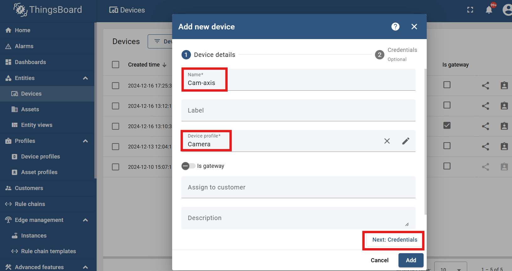
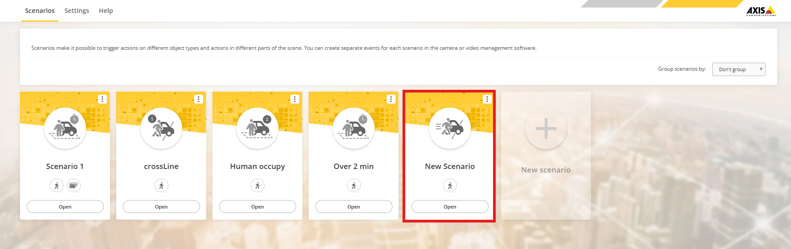

# MQTT integration with AXIS camera

## Purpose
Setup the MQTT interface to let AXIS data can reach the ThingsBoard platform by using MQTT transport.

## MQTT Client setting
### Steps
1. Setup a device profile for camera in ThingsBoard Platform
    * Go to device profile page and click add icon
    
    * Enter profile name and click next
    
    * Select MQTT transport type, you will see the MQTT device topic, and this will be used later on
    
    
    * Click "Add" button, you will see a new device profile created
    

2. Add a new device for AXIS camera in ThingsBoard Platform
    * Go to device page and click add icon
    
    * Enter device name and choose the device profile made from step1
    * Click "Add" button
    
    * Click "close" button to close the dialog
    
    * After above steps, you will see a new device row created
    

3. Copy access token of the new device
    * Click the row of the device to open the side panel
    * Click the `copy access token` button
    

4. Paste the access token into the MQTT-setting page of AXIS camera 
    * In AXIS camera interface, go to `System > MQTT` page
    * Paste the access token into the username box
     

## MQTT Publication
### Steps
1. Add a new scenario case in AXIS object analytics (AOA) application
   * Go to the Apps page to open AOA application
   
   * Add a new scenario ([AXIS AOA - User manual](https://help.axis.com/en-us/axis-object-analytics))
   
   * After adding, a new scenario can be viewed
   
2. MQTT topic prefix in AXIS camera
   * Back to the MQTT setting page in AXIS camera
   * Enter the MQTT topic prefix obtained from the device profile configuration page and click "Save"
   
3. Add condition in AXIS camera
   * Click "Add condition" button
   
   * Select the newly created scenario from Step 1 as the trigger mechanism and click "Add" button
   
   * Check the condition status to confirm successful addition
   
4. Go to the ThingsBoard platform to verify if the data has been successfully updated
   * Visit device page and open the device panel of the camera
   * Click `telemetry` tab can check the data from AXIS camera
   
    
Advanced: You can use the <b>Rule Engine</b> in ThingsBoard to separate different message type from AXIS camera.

    For example, use the Rule Engine for data preprocessing and separate messages by different topic names.

## Reference
* [How to add MQTT overlays in Axis devices](https://www.youtube.com/watch?v=8gjvOLIZtiw)
* [Device integration with MQTT-AXIS doc](https://www.axis.com/dam/public/78/37/2c/device-integration-with-mqtt-en-US-359893.pdf)
* [AXIS AOA - User manual](https://help.axis.com/en-us/axis-object-analytics)
* [ThingsBoard Rule Engine](https://thingsboard.io/docs/user-guide/rule-engine-2-0/re-getting-started/)