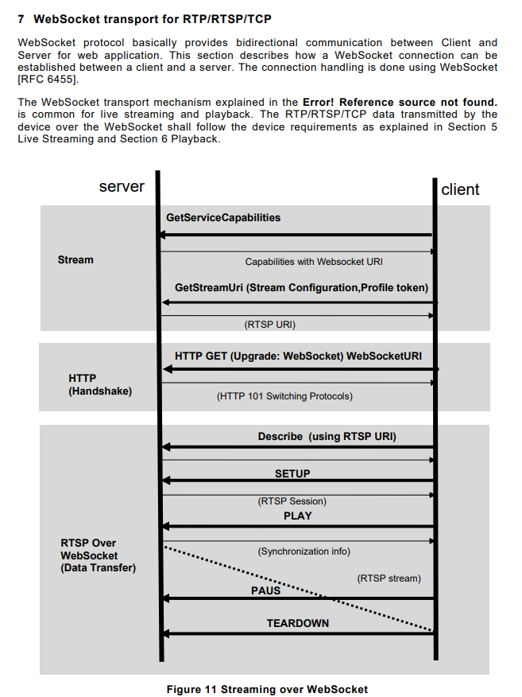

# Using AXIS media-stream-library-js
If your requirements are simple and you only need a few cameras to create a basic demo, the repository [media-stream-library-js](https://github.com/AxisCommunications/media-stream-library-js) is recommended. However, if your use case is more complex and involves managing a large number of cameras to build an NVR system, developing a custom backend system is a better approach to achieve this goal.

<br/>

## Introduction of media-stream-library-js
The technique used in this repository leverages the RTSP-over-WebSocket method to stream video on the client side.


figure from AXIS official doc

<br/>

## Example
Please ensure you import the CDN or install the plugin first!
```javascript
/* Use CDN https://github.com/AxisCommunications/media-stream-library-js/releases/download/v13.1.1/media-stream-library.min.js */
    const host = `192.168.1.xxx`;
    const encoding = 'h264'; // h264 or MJPEG
    
    const {
        pipelines,
        isRtcpBye
    } = window.mediaStreamLibrary;


    const play = (host, encoding = 'h264') => {
        const videoEl = document.querySelector(
            'video');
        const canvasEl = document.querySelector(
            'canvas');
        // Grab a reference to the video element
        let Pipeline;
        let mediaElement;
        if (encoding === 'h264') {
            Pipeline = pipelines.Html5VideoPipeline;
            mediaElement = videoEl;
            // hide the other output;
            videoEl.style.display = '';
            canvasEl.style.display = 'none';
        } else {
            Pipeline = pipelines.Html5CanvasPipeline
            mediaElement = canvasEl;
            // hide the other output
            videoEl.style.display = 'none';
            canvasEl.style.display = '';
        }

        // Setup a new pipeline
        const pipeline = new Pipeline({
            ws: {
                uri: `wss://${host}/rtsp-over-websocket`
            },
            rtsp: {
                // Without recordingId argument, the video will display live stream 
                uri: `rtsp://${host}/axis-media/media.amp?recordingid=${recordingId}&timestamp=0&videocodec=${encoding}`
            },
            mediaElement,
        });

        // Restart stream on RTCP BYE (stream ended)
        pipeline.rtsp.onRtcp = (rtcp) => {
            if (isRtcpBye(rtcp)) {
                setTimeout(() => play(host,
                    encoding), 0);
            }
        };

        pipeline.ready.then(() => {
            pipeline.rtsp.play();
        });

        return pipeline;
        // Restart stream on RTCP BYE (stream ended)
    };
    
    let pipeline;
    pipeline = play(host, encoding);
```

RTSP url: `rtsp://${host}/axis-media/media.amp?recordingid=${recordingId}&timestamp=0&videocodec=${encoding}`

<span style="color:rgb(58, 231, 58);">Info:</span> RecordingId argument is optional. If no recordingId is provided, the video will display the live stream. By the way, [Recording API](/VAPIX%20API/Recording.md) is used to get a recordingId.

---

### Specific Case
If you want to avoid being prompted to enter credentials when accessing the AXIS camera stream in a browser, you can try one of the following methods:

1. Set up a proxy to intercept Digest Authentication requests and provide the necessary authentication headers.
2. Use Basic Authentication and embed the username and password directly into the WebSocket URL, but be mindful of information security.
    ```javascript
    const pipeline = new Pipeline({
        ws: {
            uri: `wss://username:password@${host}/rtsp-over-websocket`
        },
        rtsp: {
            uri: `rtsp://${host}/axis-media/media.amp?recordingid=${recordingId}&timestamp=0&videocodec=${encoding}`
        },
        mediaElement,
    });
    ```

---

### Methods of the `library`
* self.ctx.$scope.pipeline.close(); `to stop the media stream`
* console.log(self.ctx.$scope.pipeline); `to see more detail`

<br/>

## Reference
[media-stream-library-js](https://github.com/AxisCommunications/media-stream-library-js)

[Edge Storage API - List recordings](https://developer.axis.com/vapix/network-video/edge-storage-api#list-recordings)

[Prompt for camera authentication #750](https://github.com/AxisCommunications/media-stream-library-js/issues/750)